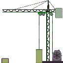

<h1 align="center"><b>Hola, soy Jesús </b></h1>

<h1 align="center">
    
</h1>
<h3 align="center"><b>SysAdmin Linux - Windows | SysDBA | Data Science | Machine Learning | Data Engineer</b></h3>

  

## <picture></picture> **Sobre mí**

 

- Ingeniero en Informática egresado del **Decanato de Ciencias y tecnología** de la [Universidad Centroccidental Lisandro Alvarado](http://www.ucla.edu.ve/). 
- Estudio más reciente en **Ciencias de Datos**, **Ingenieria de Datos**, **Machine Learning**.
- Estudios especializados en **Seguridad de la Información**, **Desarrollador Web en Entornos Libres**, **Sistemas de Base de Datos**.
- He participado en proyectos de TI en el sector de **Hidrocarburos**, **Finanzas** y **Salud**.
- Mas de 15 años trabajando como SysAdmin y SysDBA.
- Eterno apasionado a la tecnología y siempre buscando que aprender.
- Entre mis hobbies se encuentra escribir codigo, conocer y socializar con pesonas.
- Y entre mis habilidades blandas, trabajar en equipo, resilencia, resolución de problema, adaptabilidad.
- Actualmente disponible para una nueva oportunidad laboral, aquí [mi resumen](cv/CV_JesusParra.pdf)
 

## <picture></picture> **Tecnologías**

      

           &nbsp;
           &nbsp;
           &nbsp;
           &nbsp;
           &nbsp;
           &nbsp;  
           &nbsp;           
      

        

            &nbsp;
            &nbsp;
            &nbsp;
            &nbsp;
            &nbsp; 
            &nbsp;   
            &nbsp;
        
       
        

           &nbsp;
           &nbsp;
           &nbsp;
           &nbsp;
        

        

           &nbsp;
           &nbsp;
           &nbsp;
        

        

           &nbsp;
           &nbsp;
           &nbsp;
        

        

          &nbsp;
          &nbsp;
          &nbsp;
          &nbsp;
          &nbsp;
        

        

          &nbsp;
          &nbsp;
        

        

           &nbsp;
           &nbsp;
        
         
        

           &nbsp;
        

         

           &nbsp;
        

         

          &nbsp;
        

        

           &nbsp;
        

        

           &nbsp;
           &nbsp;
        

         

          &nbsp;
          &nbsp;
          &nbsp;
        

         

          &nbsp;
          &nbsp;
          &nbsp;
        
       
        

          &nbsp;
          &nbsp;
          &nbsp;
          &nbsp;
          &nbsp;
        

## <picture></picture> **Donde encontrarme**

     

        
        
        
        
        
     

